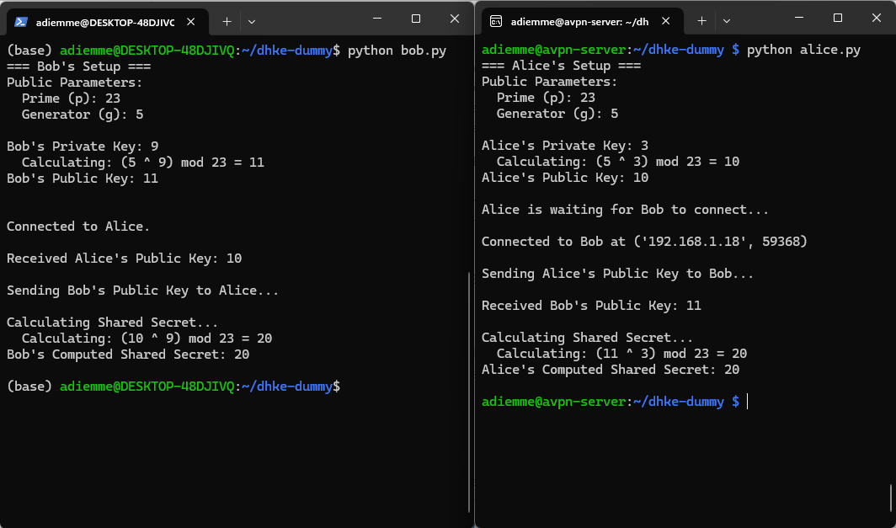

It all began when I decided to dive into the world of cybersecurity. One of the key topics I explored was asymmetric cryptography, which involves the use of private and public key pairs. Initially, I had a misconception about how RSA works, particularly in the context of SSH connections. I assumed that RSA key pairs were directly responsible for encrypting the traffic during an SSH session. However, I soon learned that asymmetric encryption methods like RSA are computationally expensive and thus unsuitable for encrypting large amounts of data.

This realization led me to explore Diffie-Hellman (DH), a protocol specifically designed for securely exchanging keys over an insecure channel. At first, I wasn’t entirely clear on how DH worked, so I turned to Qwen for assistance. Together, we created a simple Python script to demonstrate the Diffie-Hellman key exchange process step by step. Through this exercise, I gained a deeper understanding of how both RSA and DH are utilized during the initiation of SSH connections:

RSA is primarily used for authentication —verifying the identity of the server (and optionally the client).  

- Diffie-Hellman is used for securely establishing a shared secret, which is then used as the symmetric session key for encrypting the actual traffic.
- I thought it would be helpful to share the code and my learnings with others, so anyone interested can benefit from this example and better understand these fundamental cryptographic concepts.  

How does it work:  
alice.py - This works as the  "Server" application.  
bob.py - This works as the "Client" application.    

All you need to do, is to run both scripts on different machines and remember to update bob.py with the IP of the machine where alice.py is running. After that, you will see the exchange of p, n and the public keys (generated previously in both alice.py and bob.py respectively) and the calculation of the shared session key that would later be used to encrypt traffic in real world.  

Screenshot:

Enjoy!
